# Plan: Create PremiumFiber Cortex Agent for Snowflake Intelligence

## Overview

Create a Cortex Agent named `PREMIUMFIBER_EXECUTIVE_AGENT` in the `SNOWFLAKE_INTELLIGENCE.AGENTS` schema that integrates all 5 semantic views and 7 Cortex Search services for a comprehensive executive assistant.

## Architecture

```mermaid
graph TD
    subgraph agent [PremiumFiber Executive Agent]
        A[PREMIUMFIBER_EXECUTIVE_AGENT]
    end
    
    subgraph analyst [Cortex Analyst Tools]
        B1[finance_analyst]
        B2[sales_analyst]
        B3[marketing_analyst]
        B4[hr_analyst]
        B5[infrastructure_analyst]
    end
    
    subgraph search [Cortex Search Tools]
        C1[finance_docs]
        C2[sales_docs]
        C3[marketing_docs]
        C4[hr_docs]
        C5[strategy_docs]
        C6[network_docs]
        C7[demo_docs]
    end
    
    subgraph resources [Underlying Resources]
        D1[PF_FINANCE_SEMANTIC_VIEW]
        D2[PF_SALES_SEMANTIC_VIEW]
        D3[PF_MARKETING_SEMANTIC_VIEW]
        D4[PF_HR_SEMANTIC_VIEW]
        D5[PF_INFRASTRUCTURE_SEMANTIC_VIEW]
        E1[PF_SEARCH_FINANCE_DOCS]
        E2[PF_SEARCH_SALES_DOCS]
        E3[PF_SEARCH_MARKETING_DOCS]
        E4[PF_SEARCH_HR_DOCS]
        E5[PF_SEARCH_STRATEGY_DOCS]
        E6[PF_PF_SEARCH_NETWORK_DOCS]
        E7[PF_SEARCH_DEMO_DOCS]
    end
    
    A --> B1 & B2 & B3 & B4 & B5
    A --> C1 & C2 & C3 & C4 & C5 & C6 & C7
    B1 --> D1
    B2 --> D2
    B3 --> D3
    B4 --> D4
    B5 --> D5
    C1 --> E1
    C2 --> E2
    C3 --> E3
    C4 --> E4
    C5 --> E5
    C6 --> E6
    C7 --> E7
```



## Prerequisites (Already Available)

- Role: `PREMIUMFIBER_DEMO`
- Warehouse: `PREMIUMFIBER_DEMO_WH`
- 5 Semantic Views in `PREMIUMFIBER_AI_DEMO.PREMIUMFIBER_SCHEMA`
- 7 Cortex Search Services in `PREMIUMFIBER_AI_DEMO.PREMIUMFIBER_SCHEMA`

## Implementation Steps

### Step 1: Setup Snowflake Intelligence Schema

```sql
CREATE DATABASE IF NOT EXISTS SNOWFLAKE_INTELLIGENCE;
GRANT USAGE ON DATABASE SNOWFLAKE_INTELLIGENCE TO ROLE PUBLIC;
CREATE SCHEMA IF NOT EXISTS SNOWFLAKE_INTELLIGENCE.AGENTS;
GRANT USAGE ON SCHEMA SNOWFLAKE_INTELLIGENCE.AGENTS TO ROLE PUBLIC;
GRANT CREATE AGENT ON SCHEMA SNOWFLAKE_INTELLIGENCE.AGENTS TO ROLE PREMIUMFIBER_DEMO;
```

### Step 2: Create PremiumFiber Executive Agent

Create the agent with:
- **Model**: `claude-4-sonnet` for orchestration
- **5 Cortex Analyst tools** (one per semantic view)
- **7 Cortex Search tools** (one per search service)
- **Instructions**: Guide the agent to use analyst tools for structured data queries and search tools for document/policy questions

### Step 3: Grant Permissions

```sql
GRANT USAGE ON AGENT SNOWFLAKE_INTELLIGENCE.AGENTS.PREMIUMFIBER_EXECUTIVE_AGENT TO ROLE PUBLIC;
```

### Step 4: Test Agent

Test with sample queries:
- "What was total revenue last month?" (uses sales_analyst)
- "What is our PTO policy?" (uses hr_docs search)
- "Show me network incidents" (uses infrastructure_analyst)

## Agent Location

- **Database**: `SNOWFLAKE_INTELLIGENCE`
- **Schema**: `AGENTS`
- **Name**: `PREMIUMFIBER_EXECUTIVE_AGENT`
- **Access**: AI and ML > Snowflake Intelligence in Snowsight UI

## Tool Summary

| Tool Name | Type | Resource |
|-----------|------|----------|
| finance_analyst | cortex_analyst_text_to_sql | PF_FINANCE_SEMANTIC_VIEW |
| sales_analyst | cortex_analyst_text_to_sql | PF_SALES_SEMANTIC_VIEW |
| marketing_analyst | cortex_analyst_text_to_sql | PF_MARKETING_SEMANTIC_VIEW |
| hr_analyst | cortex_analyst_text_to_sql | PF_HR_SEMANTIC_VIEW |
| infrastructure_analyst | cortex_analyst_text_to_sql | PF_INFRASTRUCTURE_SEMANTIC_VIEW |
| finance_docs | cortex_search | PF_SEARCH_FINANCE_DOCS |
| sales_docs | cortex_search | PF_SEARCH_SALES_DOCS |
| marketing_docs | cortex_search | PF_SEARCH_MARKETING_DOCS |
| hr_docs | cortex_search | PF_SEARCH_HR_DOCS |
| strategy_docs | cortex_search | PF_SEARCH_STRATEGY_DOCS |
| network_docs | cortex_search | PF_PF_SEARCH_NETWORK_DOCS |
| demo_docs | cortex_search | PF_SEARCH_DEMO_DOCS |
